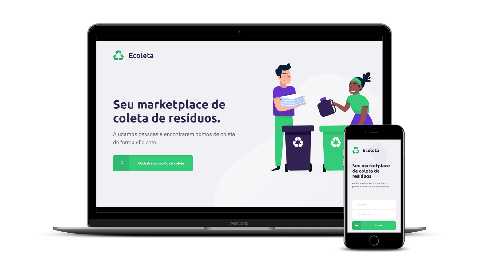

<h1 align="center">
    
</h1>

<p align="center">

  <a href="https://rocketseat.com.br">
    
  </a>

  <a href="LICENSE" >
    
  </a>
  
  <a href="https://www.linkedin.com/in/gabrielmteixeira/" >
    
  </a>

<p align="center">
  <a href="#Sobre">Sobre</a>&nbsp;&nbsp;&nbsp;|&nbsp;&nbsp;&nbsp;
  <a href="#Tech">Tecnologias</a>&nbsp;&nbsp;&nbsp;|&nbsp;&nbsp;&nbsp;
  <a href="#Layout">Layout</a>&nbsp;&nbsp;&nbsp;|&nbsp;&nbsp;&nbsp;
  <a href="#Howto">Como Usar</a>&nbsp;&nbsp;&nbsp;|&nbsp;&nbsp;&nbsp;
</p>

<a id="Sobre"></a>
## ♻️ Sobre

O Ecoleta é um projeto desenvolvido na primeira edição da Next Level Week, promovida pela Rocketseat. Aproveitando a semana do meio ambiente, foi criado um marketplace para conectar entidades e empresas que coletem resíduos orgânicos e inorgânicos com pessoas que queiram fazer o descarte seguro destes. 

O cadastro dos pontos de coleta é feito em uma aplicação web e a busca e filtro são realizados pelo usuário em uma aplicação mobile, ambas com dados provenientes de API RESTful.

<h1 align="center">
    
</h1>

<a id="Tech"></a>
## ⚙️ Tecnologias

As tecnologias utilizadas para a construção da aplicação foram:

- <a href="https://nodejs.org/">Node.js</a>
- <a href="https://www.typescriptlang.org/">Typescript</a>
- <a href="https://reactjs.org/">React</a>
- <a href="https://facebook.github.io/react-native/">React Native</a>

<a id="Layout"></a>
## 📱 Layout

<a id="Howto"></a>
## 📥 Como Usar

### Instalar API 

```bash
# Clone este repositório
$ git clone https://github.com/gabrieltx/Ecoleta-NLW-01

# Mude para diretório server
$ cd Ecoleta-NLW-01/server

# Instale as dependências
$ npm install

# Execute Migrates
$ npm knex:migrate

# Execute Seeds
$ npm knex:seed

# Inicie o servidor
$ npm run dev

```

### Instalar aplicação web

```bash
# Clone este repositório
$ git clone https://github.com/gabrieltx/Ecoleta-NLW-01

# Mude para diretório web
$ cd Ecoleta-NLW-01/web

# Instale as dependências
$ npm install

# Execute a aplicação
$ npm start

```

### Instalar aplicação mobile

```bash
# Clone este repositório
$ git clone https://github.com/gabrieltx/Ecoleta-NLW-01

# Mude para diretório mobile
$ cd Ecoleta-NLW-01/web

# Instale as dependências
$ npm install

# Execute a aplicação
$ expo start

```
